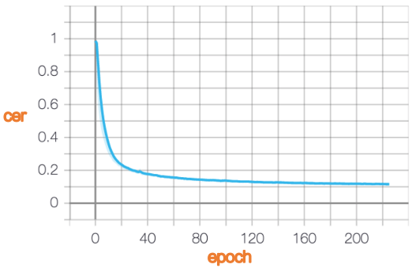
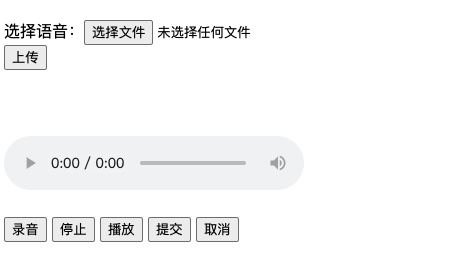

# MASR中文语音识别(pytorch版)

 - 开箱即用
 - 自行训练
 - 使用与训练分离(增量训练)
 - 识别率高

说明：因为每个人电脑机器不同，而且有些安装包安装起来比较麻烦，强烈建议直接用我编译好的docker环境跑
目前docker基础环境为ubuntu-cuda10.1-cudnn7-pytorch1.6.0（电脑没有GPU也能跑~）<br>

[docker镜像下载地址](https://hub.docker.com/r/binzhouchn/masr/tags?page=1&ordering=last_updated)，可以直接用命令<br>
```shell
docker pull binzhouchn/masr:1.6.0-cuda10.1-cudnn7
```

当然如果你不想用docker也行，有些包的安装解决方案我已给出<br>
本项目是受masr项目启发重新创建的更加完善并且能直接跑的语音识别项目，环境、数据及数据预处理代码、网络结构及预训练模型都很全


## 原理

MASR使用的是门控卷积神经网络（Gated Convolutional Network），网络结构类似于Facebook在2016年提出的Wav2letter。但是使用的激活函数不是ReLU或者是HardTanh，而是GLU（门控线性单元）。因此称作门控卷积网络。使用GLU的收敛速度比HardTanh要快。如果你想要研究卷积网络用于语音识别的效果，这个项目可以作为一个参考
以下用字错误率CER来衡量模型的表现，CER=编辑距离/句子长度，越低越好<br>
大致可以理解为1-CER就是识别准确率<br>
模型使用AISHELL-1数据集训练，共178小时的录音，覆盖了4300多个汉字。工业界使用的语音识别系统通常使用至少10倍于本项目的录音数据来训练，同时使用特定场景的语料来训练语言模型，所以和工业界大型企业的识别效果还有些差距。

<br>
上图为验证集的cer随epoch的训练曲线


## 参考项目地址链接(原项目作者貌似不再维护，预训练模型存在无法下载和代码无法直接跑的问题)

https://github.com/nl8590687/ASRT_SpeechRecognition<br>
https://github.com/nobody132/masr<br>
https://github.com/xxbb1234021/speech_recognition


## 依赖包

```text
torch==1.6.0
Levenshtein==0.12.0
librosa==0.8.0
warpctc_pytorch==0.2.1
tensorboardX==2.1
ctcdecode==1.0.2
pycorrector==0.3.0 #Chinese Text Error Corrector
sounddevice==0.4.1
pyaudio==0.2.11
Flask==1.1.2
Flask-Cors==3.0.9
tqdm==4.50.2
joblib==1.0.0
werkzeug==1.0.0
gunicorn==20.0.4
```

----pyaudio安装比较麻烦，解决方案----

#linux下参考
```shell
apt-get install libasound-dev portaudio19-dev libportaudio2 libportaudiocpp0 portaudio19-dev python-all-dev python3-all-dev
pip install pyaudio
```
#mac下参考
```shell
brew update
brew install portaudio
brew link --overwrite portaudio
pip install pyaudio
```

----ctcdecode安装解决方案----
```shell
git clone --recursive https://github.com/parlance/ctcdecode.git
cd ctcdecode
pip install .
```
如果你是在国外以上语句没有问题，如果不是则需要单独下载[openfst-1.6.7.tar.gz](https://download.csdn.net/download/quantbaby/15908785)和[boost_1_67_0.tar.gz](https://download.csdn.net/download/quantbaby/15909444)，解压到third_party目录下，然后setup.py中注释掉以下这两行代码
```python
download_extract('https://sites.google.com/site/openfst/home/openfst-down/openfst-1.6.7.tar.gz',
                 'third_party/openfst-1.6.7.tar.gz')
download_extract('https://dl.bintray.com/boostorg/release/1.67.0/source/boost_1_67_0.tar.gz',
                 'third_party/boost_1_67_0.tar.gz')
```
再运行pip install .，即可成功~

----导入soundfile时提示 OSError: sndfile library not found----
```shell
apt-get install libsndfile1
```


## 数据和模型下载地址

| 训练数据及模型 | 下载链接 |
| :---: | :---: |
| AISHELL-1数据集下载 | [点击下载](http://www.aishelltech.com/kysjcp) |
| ST-Chinese-Mandarin-Corpus数据集下载 | [点击下载](http://www.openslr.org/resources/38) |
| THCHS-30数据集下载 | [点击下载](http://www.openslr.org/resources/18) |
| LM语言模型zh_giga.no_cna_cmn.prune01244.klm | [点击下载](https://deepspeech.bj.bcebos.com/zh_lm/zh_giga.no_cna_cmn.prune01244.klm) |
| LM超大语言模型zhidao_giga.klm(70G) | [点击下载](https://deepspeech.bj.bcebos.com/zh_lm/zhidao_giga.klm) |
| 预训练模型（aishell-1数据集训练） | [点击下载](https://download.csdn.net/download/quantbaby/15909010) |
| 预训练模型（aishell, ST-CMC, thchs-30训练） | [点击下载](https://share.weiyun.com/3VWtGUBo) |
| 预训练模型（超大数据集训练，1300h+） | [点击下载](https://share.weiyun.com/drQfaovf) |

**AISHELL-1数据集下载后解压放到data_aishell对应文件夹下**


## 原始数据预处理(以aishell-1为例)

#### 预处理方式一
你可以使用自己的数据集来训练模型。你的数据集需要包含至少以下3个文件：
 - train.index
 - dev.index
 - labels.gz

train.index和dev.index为索引文件，表示音频文件和标注的对应关系，应具有如下的简单格式：
```text
/path/to/audio/file0.wav,数据预处理
/path/to/audio/file1.wav,小时不识月
...
```

labels.gz是cpr文件，应包含数据集标注中出现过的所有字符，表示为一个list数组。其中开头首字符必须是无效字符（可任意指定，不和其他字符重复就行），预留给CTC作为blank label;建议索引0为'_'，索引28位' '
```text
[
   '_', // 第一个字符表示CTC空字符，可以随便设置，但不要和其他字符重复。
   '小',
   '时',
   '不',
   '识',
   '月',
   ...
]
```
处理好后放到data_aishell目录下<br>

#### 预处理方式二
train.index和dev.index为索引文件，表示音频文件和标注的对应关系，应具有如下的简单格式：
```text
/path/to/audio/file0.wav,数据 预 处理
/path/to/audio/file1.wav,小时 不识 月
...
```

labels.gz是cpr文件，应包含数据集标注中出现过的所有字符，表示为一个list数组。其中开头首字符必须是无效字符（可任意指定，不和其他字符重复就行），预留给CTC作为blank label;建议索引0为'_'，索引28位' '
```text
[
   '_', // 第一个字符表示CTC空字符，可以随便设置，但不要和其他字符重复。
   '小时',
   '不识',
   '月',
    '预',
    '处理'
   ...
]
```
**注：如果是方式二处理，则data.py中MASRDataset类读取数据后处理的方式要有所改动**<br>
原始数据集AISHELL-1已经给我们分好词，也可以自行用jieba分词

[数据预处理代码notebook](AISHELL-1数据预处理.py)


## 音频转换

自己提供的音频采样率可能不同，需要运行以下代码将采样率转成16000hz
```python
import wave
f = wave.open(audio_path_r, "rb")
str_data = f.readframes(f.getnframes())
f.close()
file = wave.open(audio_path_w, 'wb')
file.setnchannels(1)
file.setsampwidth(4)
file.setframerate(16000)
file.writeframes(str_data)
file.close()
```


## 模型训练(GPU)

氪金玩家可自行训练，目前单卡V100跑每个epoch需要30min
```shell
sudo nvidia-docker run -v $PWD/masr:/workspace/masr  -w /workspace/masr binzhouchn/masr:1.6.0-cuda10.1-cudnn7 python -u train.py
```
也可以用我训练好的模型（并不是训练最好的），[下载地址](https://download.csdn.net/download/quantbaby/15909010)<br>
【*目前SOTA预训练模型可私信向我要】


## 模型预测(CPU)

如果你是用GPU进行预测，则需要改动models/base.py代码，torch.load去掉map_location参数<br>

#### 预测方式一
可以跑examples下的demo-recognize.py；<br>
推荐跑beamdecode.py，CTCBeam解压更加准确，记得修改要识别的wav文件地址

#### 预测方式二
起flask服务进行预测
```shell
sudo docker run -d -p 5005:5005 -v $PWD/masr:/workspace/masr  -w /workspace/masr binzhouchn/masr:1.6.0-cuda10.1-cudnn7 gunicorn -b :5005 masr_server:app
```
网页界面显示<br>



## 录制自己的声音

```python
cd examples
python demo-record-recognize.py
```
直接跑examples中的demo-record-recognize.py，可以在看到提示「录音中」后开始说话，你有5秒钟的说话时间（可以自己在源码中更改）


## 使用声学嵌入寻找音近字

你可能听说过**词嵌入**（word embedding）。作为神经语言模型的底层，词嵌入可以将词映射到一个低维连续空间中，并且使意思相近或相关的词有着较近的cosine距离，通过比较这个距离，可以找出一个词的近义词<br>
我们使用类似的思想将汉字嵌入到一个（较）低维的连续空间中，并使读音相近的汉字有着相近的cosine距离，并根据cosine距离来寻找音近字。如图，我们找到了嵌入空间中离「掉」最近的5个字，它们的读音也确实与「掉」接近<br>


#### 使用MASR获取声学嵌入

使用MASR的预训练模型，我们就能构造出这样一个声学嵌入(acoustic embedding)来。

在MASR的输出层有4335个单元，分别表示4334个汉字（严格地说不完全是汉字）和1个CTC的特殊标记。

在输出层之前有一个隐藏层，包含1000个单元。

连接他们的是一个$4335 \times 1000$的矩阵$W_{ij}$，对于第$i$个汉字，使用向量$W_i$作为它的嵌入向量即可。

使用声学嵌入给了我们直观判断一个声学模型是否合理的方式，你会发现，大多数情况下，MASR的预训练模型给出的音近字都是较为准确的。

#### 自己试试

执行以下文件，多试几个汉字，看准不准。

```shell
cd examples
python embedding.py
```


## TODO

1. 不是很推荐pyaudio+wave这个组合，可以自行换掉，用sounddevice+scipy(scipy.io.wavfile)或者pysoundfile
2. 自行增量训练并更换GatedConv模型以达到更好工业级效果
3. tensorflow重写

*欢迎在dev分支提交优化本项目
